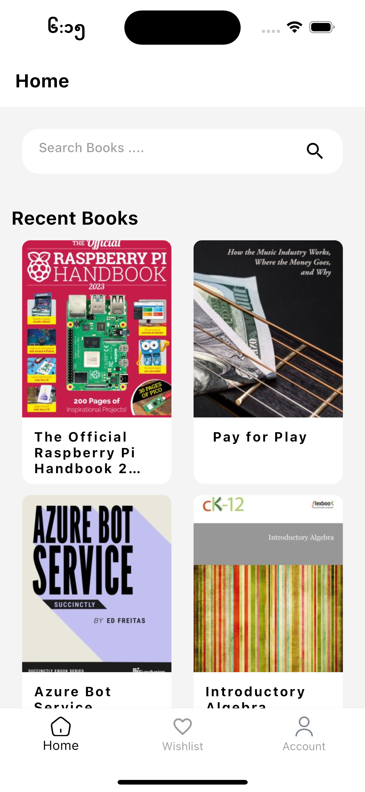
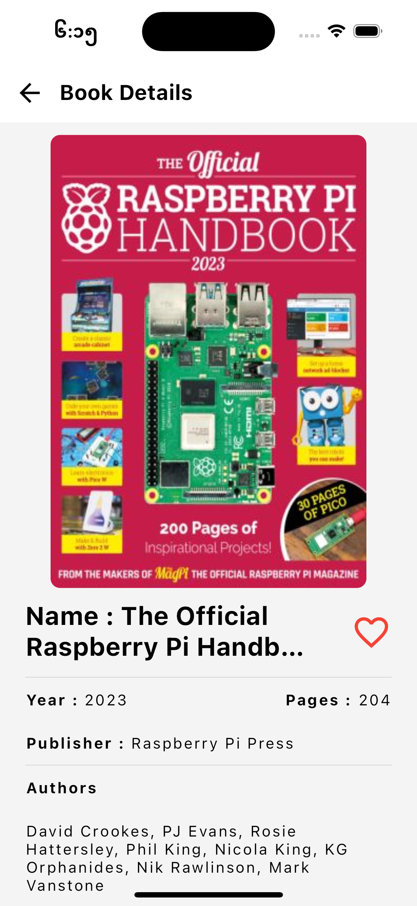
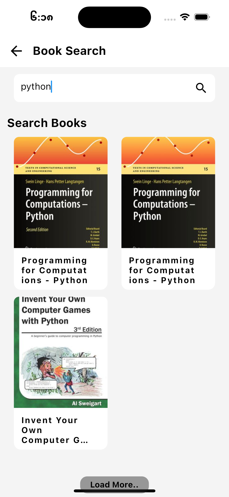
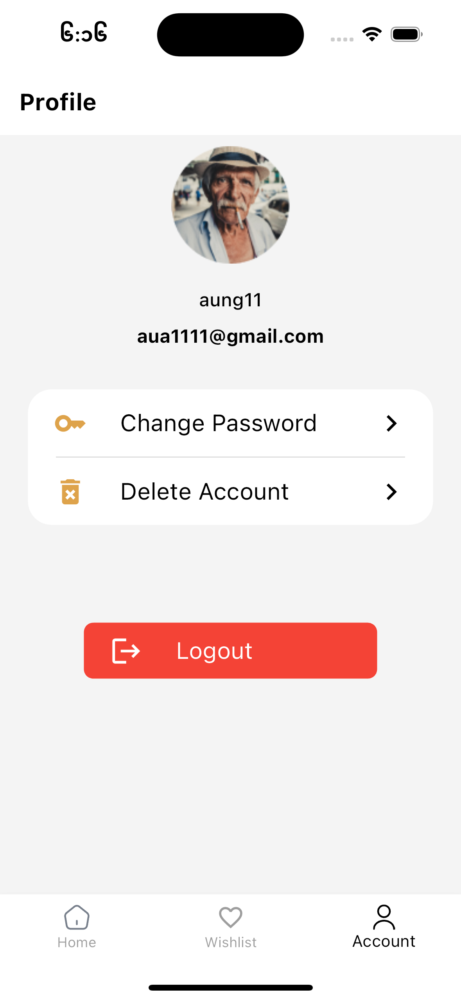
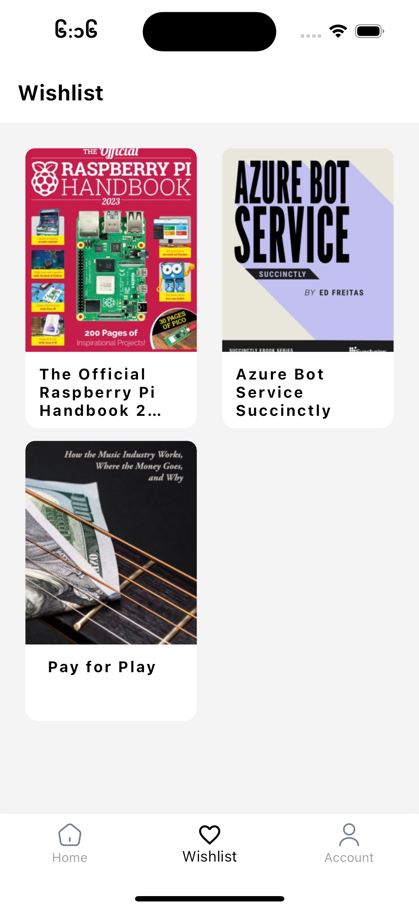
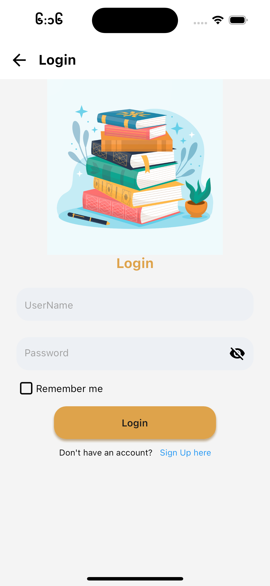
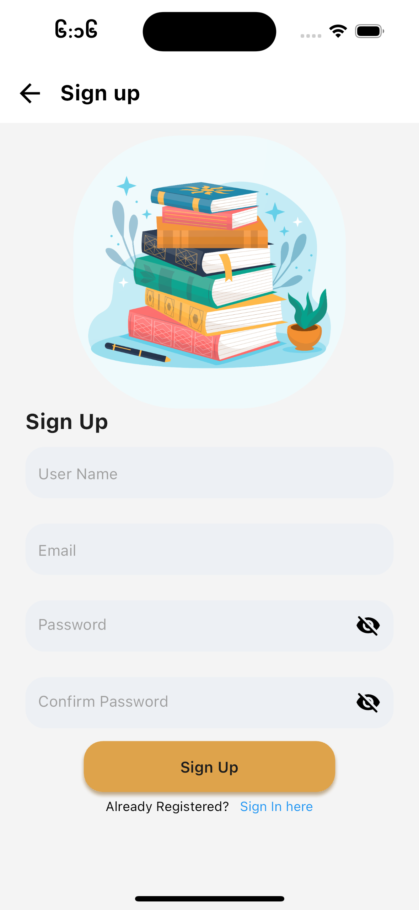

# dbook
Flutter SDK : 3.10.6
Database    : SQFilte

API :  Dbooks 
1.Home Screen 
  
2.BookDetails Screen 
  
3.Book Search Screen 
  
4.Profile Screen 
  
5.Wishlist Screen 
  
6.Login Screen 
  
7.Signup Screen 
  
